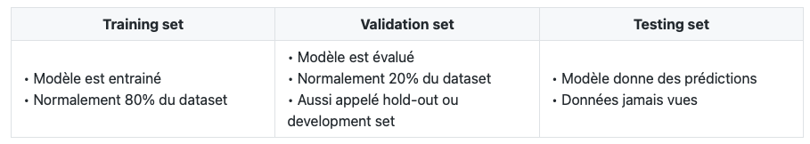
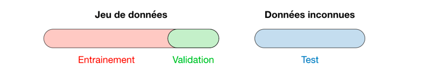
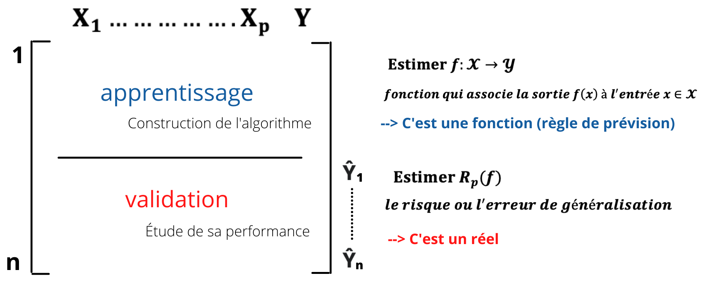

```{r setup, include=FALSE}
knitr::opts_chunk$set(echo = TRUE)
```

\begin{center}
 \rule{0.5\linewidth}{2pt}
 \end{center}

# Introduction à l'estimation de l'erreur de prévision

La performance du modèle statistique ou algorithme statistique s'évalue par un **risque** ou une **erreur de prévision**, dite encore **erreur de généralisation** dans le cas de la régression et de la classification. Une estimation du risque est importante dans le sens où elle guide dans la stratégie de choix de méthodes et de choix de modèles en science des données. Une mesure de la qualité ou de la performance du modèle permet aussi de considérer la confiance que l'on peut accorder à la prévision du modèle. 

<br><br>

<<<<<<< HEAD
*Pour chaque méthode : une fiche descriptive s'appuyant notamment sur un ou des schémas inédits* 
### Validation (croisée) hold out
=======
On considère que l'on dispose d'un **échantillon de données observées de type entrée-sortie** de taille $n$ : $d^n_1 = \left\{(x_1,y_1),...,(x_n,y_n)\right\}$ avec $x_i \in \cal{X}$ quelconque (souvent égal à $\mathbb{R}^p$), $y_i \in \cal{Y}$ pour i = 1...n. L'objectif, pour tout algorithme ou modèle statistique, est de prédire la sortie $y$ associée à une nouvelle entrée $x$, sur la base de $d^n_1$. Cette sortie peut être quantitative (i.e $\cal{Y} \in \mathbb{R}^d$) et nous sommes en *régression*, ou bien qualitative (i.e $\cal{Y} =$ {1...K} ou $\cal{Y} =$ {-1,1}) et nous parlons de *discrimination/classification supervisée* ou de *discrimination binaire*. Nous nous plaçons ici dans le cadre de l'apprentissage statistique supervisé c'est-à-dire que l'on connaît ce que l'on doit expliquer (i.e les sorties $y_i$). Une **règle de prédiction ou un algorithme de prévision (en régression ou en discrimination)** est donc la fonction mesurable $f : \cal{X} \rightarrow \cal{Y}$ qui associe la sortie $f(x)$ à l’entrée $x \in \cal{X}$.
>>>>>>> 27bc793453e780685b6abc2f0d33802c9391bf84

<br><br>

Une fois que la notion de modèle statistique ou de règle de prévision est précisée, le **risque** est défini à partir d'une *fonction perte* associée. Soit $l: \cal{Y} \times \cal{Y} \rightarrow \mathbb{R}$ une fonction de perte, le **risque ou l'erreur de généralisation** d'une règle de prédiction f est défini par $R_p(f) = \mathbb{E}_{(X,Y)} \left[ l(Y,f(X)\right]$. En pratique, ce risque nécessite d'être estimé et différentes stratégies sont proposées puisque l'on suppose que $d^n_1$ est l'observation d’un n-échantillon $D^n_1 = \left\{(X_1,Y_1),...,(X_n,Y_n)\right\}$ d’une loi conjointe P sur $\cal{X} \times \cal{Y}$, totalement inconnue et que x est une observation de la variable X, (X,Y) étant un couple aléatoire de loi conjointe P indépendant de $D^n_1$ *(modèle statistique non paramétrique)*.

<br><br>

La façon la plus simple d'estimer sans biais ou de biais réduit l'erreur de prévision consiste à utiliser un échantillon indépendant n'ayant pas participé à l'estimation du modèle. Plusieurs stratégies, étudiées ci-dessous, sont proposées pour **éviter d'utiliser les mêmes données pour estimer un modèle et une erreur**. 

<br><br>

# Les différentes techniques de ré-échantillonnage

## Le vocabulaire 

<<<<<<< HEAD
## Conclusion
*les liens éventuels entre les différentes méthodes et des recommandations à destination des practicien.ne.s.*
=======
Lors de la sélection d'un modèle, on divise les données en trois différentes parties. Ces dernières sont représentées dans le tableau et la figure ci-dessous : 

```{r echo=FALSE, out.width='100%'}

```

```{r echo=FALSE, out.width='100%'}

```

## La validation croisée 
**(aussi notée CV pour "Cross-Validation")**

### -> Approche de validation croisée ou croisée hold-out

L'**approche de validation croisée hold-out** consiste à séparer l'échantillon de données $d^n_1$ en ***deux*** : un *échantillon d'apprentissage* $d_{n,app}$ pour construire l'algorithme de prédiction et un *échantillon de validation ou de test* $d_{n,test}$ pour estimer le risque de la règle de prévision. 

```{r echo=FALSE, out.width='100%'}

```

Cette approche nécessite d'avoir un nombre suffisant d'observations dans l'échantillon d'apprentissage pour **bien ajuster l'algorithme de prévision** ainsi qu'un nombre suffisant d'observations dans l'échantillon de test **pour bien estimer l'erreur de l'algorithme**.

<br><br>

L'inconvénient de cette approche est que l'erreur est **très dépendante de la partition "Apprentissage/Validation"**. Donc il faut au minimum la reproduire avec plusieurs partitions.

### -> Approche de validation croisée K-fold

Ici on repète la méthode d'échantillonnage précédente HO sur différentes partitions. Il est plus adapté que le précédent lorsqu'on a peu d'observations. Le choix de K doit être fait par l'utilisateur (souvent K=10).
On divise l'échantillon en K sous-échantillons, puis on sélectionne un des K échantillons comme ensemble de validation et la réunion des K - 1 autres comme ensemble d'apprentissage.
On calcule l'erreur (de régression ou de discrimination) sur l'échantillon de validation comme pour l'approche précédente. 
On répète l'opération K fois pour que chaque sous-échantillon ait été utilisé une fois comme ensemble de validation. La moyenne des K erreurs estime alors l'erreur de régression ou de discrimination.
Erreur relativement faible, mais qui peut soufffrir d'un manque de "brassage" des données
Plus long mais plus précis, estime mieux, moins de variance
faire schéma

### -> Approche de validation croisée leave-p-out

leave-on-out : lorsque K=n, on parke de validation croisée leave one out
inconvénient : complexité algorithme souvent trop grande

## Algorithme de bootstrap

Une autre approche que la validation croisée est celle du **bootstrap**. Il s'agit d'approcher par simulation *(Monte Carlo)* la distribution d'un estimateur lorsque l'on ne connaît pas la loi de l'échantillon, ou lorsqu'on ne peut pas supposer qu'elle est gaussienne.

<br><br>

On appelle **échantillon bootstrap** le tirage de n individus pris au hasard avec remise parmis les n individus de départ. 


# Conclusion

**Le risque ou l'erreur de généralisation n'indique rien (ou très peu) sur les performances du modèle construit sur la totalité des données.** Il est nécessaire de procéder à des **méthodes de ré-échantillonnage** comme la validation croisée ou le bootstrap. Pour chaque approche, l'erreur en test estime l'erreur du modèle construit sur la partie apprentissage.

<br><br>

Le découpage "Apprentissage/Test" en validation croisée n'est vraiment intéressant que pour les grandes bases de données. La K-validation croisée et le leave-one-out proposent des performances équivalentes en général. Choisir K=10 est un bon compromis pour la validation croisée.
>>>>>>> 27bc793453e780685b6abc2f0d33802c9391bf84

<br><br>

Le bootstrap a en général une variable plus faible que la validation croisée, mais un biais plus fort et on ne peut pas réellement agir dessus. C'est pourquoi, les approches de validation croisée et de bootstrap se valent, surtout quand la taille de l'échantillon augmente. En pratique, les chercheurs privilégient la validation croisée, qui est peut-être plus simple à implémenter. Néanmoins, cet outil joue un rôle central dans les algorithmes récents de combinaison de modèles. Il ne peut être négligé.